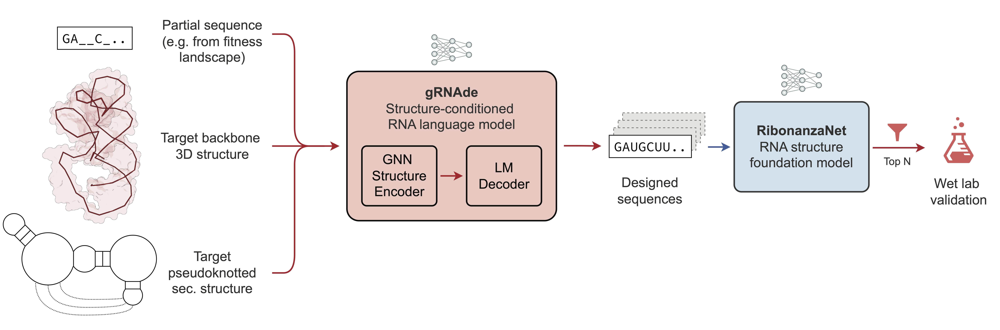

# Generative inverse design of RNA structure and function with gRNAde

[](https://www.biorxiv.org/content/10.1101/2025.11.29.691298)
[](LICENSE)
[](https://huggingface.co/chaitjo/gRNAde)
[](https://colab.research.google.com/drive/16rXKgbGXBBsHvS_2V84WbfKsJYf9lO4Q)

**gRNAde** is a generative AI framework for RNA inverse design. 
gRNAde learns RNA design rules from 3D RNA structures, allowing it to capture complex tertiary interactions (like pseudoknots and non-canonical base pairs) with expert-level accuracy and design functional RNAs, including aptamers and ribozymes.



*gRNAde stands for Geometric RNA Design; pronounced as ‘grenade’*

---

⚙️ **Need help with new RNA design problem?** Check out the [Example design notebook](/projects/openknot_benchmark/design.ipynb) and please [contact Chaitanya](mailto:chaitanya.joshi@cl.cam.ac.uk) for collaborations!

🧬 **New to 3D RNA modeling?** Check out this [curated reading and watch list](https://www.chaitjo.com/post/rna-modelling-and-design/) for beginners

🤗 **Data and Checkpoints**: [HuggingFace repository](https://huggingface.co/chaitjo/gRNAde)

🧪 **Experimental Validation**: [Generative inverse design of RNA structure and function with gRNAde](https://www.biorxiv.org/content/10.1101/2025.11.29.691298) (bioRxiv preprint)

📄 **Methodology**: [gRNAde: Geometric Deep Learning for 3D RNA inverse design](https://arxiv.org/abs/2305.14749) (ICLR 2025 Spotlight)

## ⭐️ Key Features

- **3D RNA Design:** Conditions on 3D coordinates to capture non-canonical pairings and tertiary motifs that 2D-only methods miss. Supports multi-modal design specifications including pseudoknotted secondary structures, 3D backbones, and partial sequence constraints (e.g., from fitness landscapes)

- **Expert-Level Accuracy on Pseudoknots:** Matches human expert performance on the Eterna OpenKnot Benchmark while being fully automated.

- **Functional Design Campaigns:** Capable of generating active ribozyme variants with high sequence divergence from the wild type.

- **High-Throughput Pipeline with Screening:** Includes built-in wrappers for RibonanzaNet and RhoFold to generate and filter millions of candidates automatically.

## 🚀 Getting Started

### 1. **Installation:** 

Set up your Python environment, install dependencies, and download checkpoints from HuggingFace following the instructions in [`docs/installation.md`](docs/installation.md).

### 2. **Datasets:** 

Optionally, download pre-processed datasets and/or raw 3D structures from HuggingFace, following the instructions in [`docs/data_setup.md`](docs/data_setup.md). This data can be used for training new gRNAde models.

### 3. **Training Models:** 

The [`main.py`](main.py) script can be used to train new gRNAde models. Simply run:
  ```sh
  python main.py --config configs/default.yaml
  ```

The `src` directory houses all the code for the gRNAde design pipeline. The codebase is integrated with Weights&Biases for logging as well as hyperparameter tuning/running sweeps.

### 4. **Running the gRNAde Design Pipeline:** 

The fastest way to get started is with the [`design.py`](design.py) command-line script, which provides a production-ready interface for the complete design workflow:
  ```sh
  python design.py --config configs/design.yaml
  ```

This automated pipeline will:
- Load model checkpoints and target structures
- Generate diverse candidate sequences with gRNAde (conditioned on 3D coordinates, secondary structure, and optional sequence constraints)
- Screen candidates with RibonanzaNet for structural accuracy
- Filter and rank designs based on configurable metrics
- Save top designs for experimental validation
  
See [`docs/creating_designs.md`](docs/creating_designs.md) for detailed documentation, configuration options, and best practices. 
  
For interactive exploration and customization, see the [example design notebook](projects/openknot_benchmark/design.ipynb).

### 5. **Reproducing Design Campaigns:** 

All design campaigns from the paper are available in the `projects/` directory with complete code and step-by-step READMEs to reproduce results and generate figures:
- `projects/openknot_benchmark/`: Eterna OpenKnot designs for riboswitches, ribozymes, viral elements, and other complex RNA pseudoknot structures.
- `projects/rna_polymerase_ribozyme/`: Functional RNA polymerase ribozyme engineering campaign.

### 6. **Reproducing ICLR 2025 Paper Benchmarks:** 

The codebase corresponds to the first stable, experimentally validated version of gRNAde (`v1.0.0`) used in "[Generative inverse design of RNA structure and function with gRNAde](https://www.biorxiv.org/content/10.1101/2025.11.29.691298)".
All the code and data used for the previous [ICLR 2025 Spotlight paper](https://openreview.net/forum?id=lvw3UgeVxS) introducing the gRNAde methodology is available in release `v0.3.2`, with detailed instructions for reproducing the computational benchmarks: https://github.com/chaitjo/geometric-rna-design/releases/tag/v0.3.2

## 📂 Directory Structure

```markdown
.
├── README.md
├── LICENSE
|
├── main.py                         # Main script for training and evaluating models
├── design.py                       # Command-line script for RNA sequence design
|
├── .env.example                    # Example environment file
├── .env                            # Your environment file
|
├── checkpoints                     # Model checkpoints
├── configs                         # Configuration files directory
├── data                            # Dataset and data files directory
├── wandb                           # W&B output directory
|
├── docs                            # Documentation directory
|   ├── creating_designs.md         # Guide to using design.py for RNA design
|   ├── installation.md             # Installation instructions
|   └── data_setup.md               # Data preparation guide
|
├── tools                           # Directory for external tools
|   ├── rhofold                     # RNA sequence to 3D structure prediction tool
|   ├── ribonanzanet                # RNA sequence to chemical mapping prediction tool
|   └── ribonanzanet_sec_struct     # RNA sequence to pseudoknotted secondary structure prediction tool
|
├── src                             # Source code directory for gRNAde
|   ├── constants.py                # Constant values for data, paths, etc.
|   ├── evaluator.py                # Evaluation metrics and computational filtering pipeline
|   ├── layers.py                   # PyTorch modules for building gRNAde models
|   ├── models.py                   # Main gRNAde model code
|   ├── trainer.py                  # Training loop for gRNAde
|   |
|   └── data                        # Data-related code
|       ├── clustering_utils.py     # Methods for clustering by sequence and structural similarity
|       ├── data_utils.py           # Methods for loading PDB files and handling coordinates
|       ├── dataset.py              # Dataset and batch sampler class
|       ├── featurizer.py           # Featurizer class
|       └── sec_struct_utils.py     # Methods for secondary structure prediction and determination
|
└── projects                        # Code for reproducing design campaigns in the paper
    ├── openknot_benchmark          # Eterna OpenKnot Benchmark for psuedoknotted RNA design
    └── rna_polymerase_ribozyme     # Generative Design of RNA polymerase ribozymes
```

## Citations

```
@article{joshi2025generative,
  title={Generative inverse design of RNA structure and function with g{RNA}de},
  author={Joshi, Chaitanya K and Gianni, Edoardo and Kwok, Samantha LY and Mathis, Simon V and Lio, Pietro and Holliger, Philipp},
  journal={bioRxiv},
  year={2025},
  publisher={Cold Spring Harbor Laboratory}
}

@inproceedings{joshi2025grnade,
  title={g{RNA}de: Geometric Deep Learning for 3D RNA inverse design},
  author={Joshi, Chaitanya K and Jamasb, Arian R and Vi{\~n}as, Ramon and Harris, Charles and Mathis, Simon V and Morehead, Alex and Anand, Rishabh and Li{\`o}, Pietro},
  booktitle={International Conference on Learning Representations (ICLR)},
  year={2025},
}

@incollection{joshi2024grnade,
  title={g{RNA}de: A Geometric Deep Learning pipeline for 3D RNA inverse design},
  author={Joshi, Chaitanya K and Li{\`o}, Pietro},
  booktitle={RNA Design: Methods and Protocols},
  pages={121--135},
  year={2024},
  publisher={Springer}
}
```
